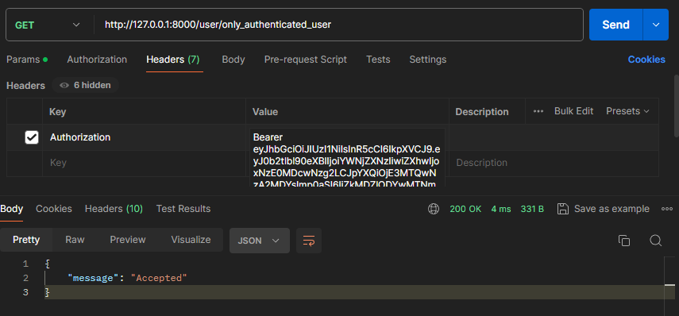

## 회원가입
http://127.0.0.1:8000/user/session_signup
```
{
    "username" : "mseo",
    "password": 1234,
    "email" : "mseo@naver.com",
    "age":24
}
```

### session
> django에서는 session이 기본으로 적용된다고 한다. 따라서 따로 기능을 만들어 주지 않아도 된다
 * 로그인 API user/session_signin
 * 회원가입 API user/session_signup


---

### jwt
 * 로그인 API user/jwt_signin

#### 세팅
* django에서 제공하는 jwt 패키지가 2개 있는데 차이가 궁금했다
    ```
    ✅ 차이점
    djangorestframework-jwt
    - Django의 인증 시스템을 사용하여 토큰을 생성
    - access 토큰만을 제공하며, refresh 토큰을 별도로 관리해야 함
    - 현재 업데이트가 안됨

    djangorestframework-simplejwt
    - Django의 인증 시스템과 상관없이 토큰을 생성
    - access 토큰과 refresh 토큰을 함께 제공

    따라서,, jwt를 사용하면 refresh 토큰도 기본적으로 사용하기 때문에 djangorestframework-simplejwt를 사용한다
    ```
1. 설치
    ```
    pip install djangorestframework_simplejwt
    ```
2. settings.py 설정
    ```
    1) INSTALLED_APPS에 'rest_framework_simplejwt' 추가

    2)
    REST_FRAMEWORK = {
        'DEFAULT_AUTHENTICATION_CLASSES': (
            'rest_framework_simplejwt.authentication.JWTAuthentication',
        ),
    }```

3. SIMPLE_JWT 설정
    ```
    from datetime import timedelta

    SIMPLE_JWT = {
        'ACCESS_TOKEN_LIFETIME': timedelta(minutes=3),
        'REFRESH_TOKEN_LIFETIME': timedelta(days=7),
    }
    ```

    | 속성                      | 설명                                             | 타입       | 기본값   |
    |---------------------------|--------------------------------------------------|------------|----------|
    | ACCESS_TOKEN_LIFETIME     | Access 토큰의 수명                              | timedelta  | 5분      |
    | REFRESH_TOKEN_LIFETIME    | Refresh 토큰의 수명                             | timedelta  | 1주일    |
    | ROTATE_REFRESH_TOKENS     | Refresh 토큰이 사용될 때마다 새로운 토큰 생성   | boolean    | False    |
    | BLACKLIST_AFTER_ROTATION  | 토큰 회전 후 블랙리스트 추가 여부               | boolean    | False    |
    | UPDATE_LAST_LOGIN         | 마지막 로그인 시간 업데이트 여부                | boolean    | True     |
    | ALGORITHM                 | 토큰 서명에 사용할 알고리즘                     | str        | 'HS256'  |
    | SIGNING_KEY               | 서명에 사용할 키                                 | str        | settings.SECRET_KEY |
    | VERIFYING_KEY             | 서명 검증에 사용할 키                           | str        | settings.SECRET_KEY |
    | AUTH_HEADER_TYPES         | Authorization 헤더에서 사용할 인증 유형          | list       | ['Bearer'] |
    | USER_ID_FIELD             | 사용자 모델의 고유 식별자 필드 이름            | str        | 'id'     |
    | USER_ID_CLAIM             | JWT에 포함될 사용자 식별자 클레임 이름         | str        | 'user_id'|
    | TOKEN_TYPE_CLAIM          | JWT에 포함될 토큰 유형 클레임 이름            | str        | 'token_type'|
    | JTI_CLAIM                 | JWT에 포함될 토큰 식별자 클레임 이름          | str        | 'jti'    |
    | AUTH_TOKEN_CLASSES        | 사용할 토큰 클래스                              | list       | ['rest_framework_simplejwt.tokens.AccessToken', 'rest_framework_simplejwt.tokens.RefreshToken'] |
    | AUTH_COOKIE               | 인증 토큰을 저장할 쿠키 이름                   | str        | None     |
    | AUTH_COOKIE_HTTP_ONLY     | 인증 쿠키를 HTTP 전용으로 설정할지 여부         | boolean    | True     |
    | AUTH_COOKIE_PATH          | 인증 쿠키의 경로                                | str        | '/'      |
    | AUTH_COOKIE_SAMESITE      | 인증 쿠키의 SameSite 속성                       | str        | 'Lax'    |
    | AUTH_COOKIE_SECURE        | 인증 쿠키를 안전하게 전송할지 여부             | boolean    | False    |

#### access token
1. 생성

    

2. 인증

    

    * 요청
      * Authorization: Bearer [JWT 토큰]
    * @authentication_classes([JWTAuthentication])
      * JWT(JSON Web Token)를 사용하여 인증
    * @permission_classes([IsAuthenticated])
      * 인증된 사용자에게만 접근을 허용
---

### 비밀번호 암호화
* make_password()
  * django에서 제공하는 함수
  * PBKDF2 알고리즘
    * salt
    * 키 스트레칭
* bcrypt
    * 따로 설치해야 함
    * salt
    * 키 스트레칭